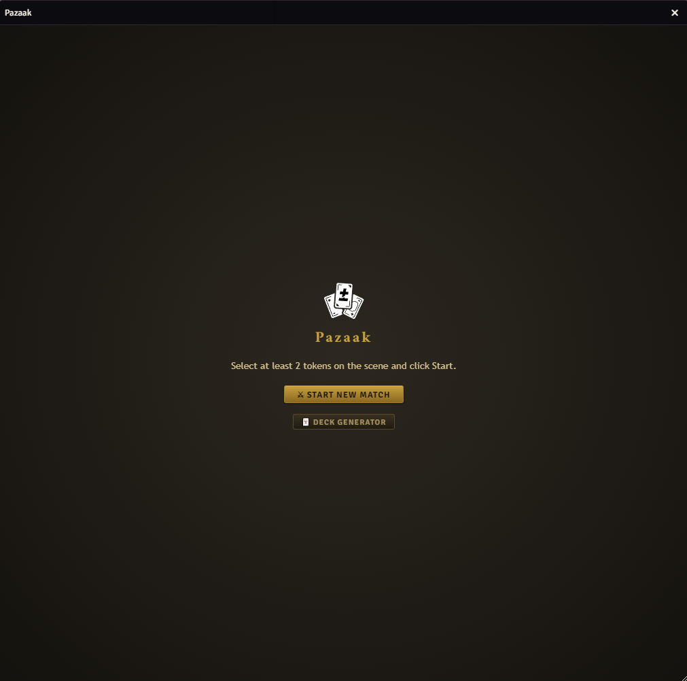
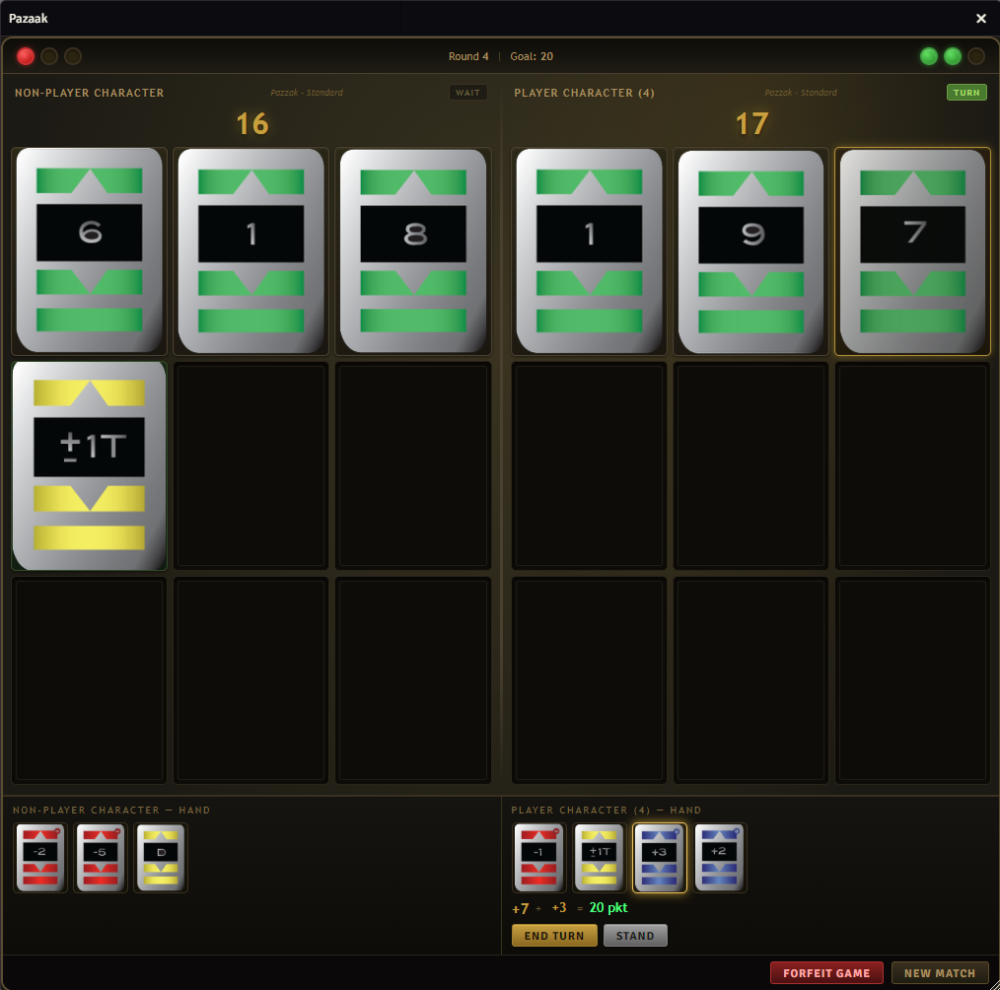
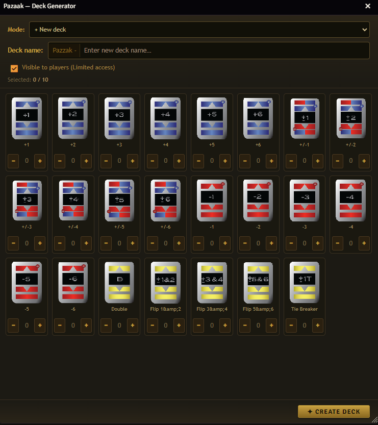
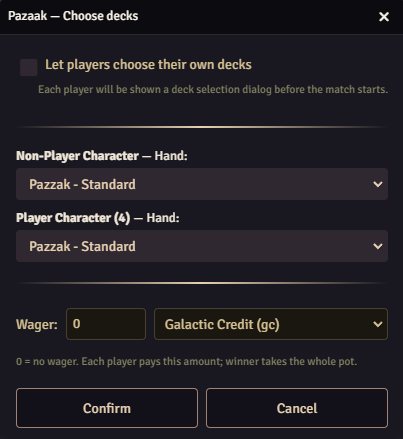

    
    
    
    

# 
Pazaak — Foundry VTT Module+

A Pazaak card game from Star Wars for 2 players, implemented as a Foundry VTT module (v13+). System-agnostic.

---

## 🎲 How to Play

Each player draws a card from the main deck (values 1–10) and adds it to their score. The goal is to reach exactly **20** (configurable). Going over is a **bust** — you lose the round. Players can also play a special card from their hand to adjust their score, then choose to **end their turn** or **stand** (lock their score for the round).

The round is won by whoever has the highest score at or below the target. First to win **3 rounds** wins the match.

**Special rules:**
- Drawing 9 cards without busting → automatic stand and round win
- Exact match of the target → automatic stand

---

## 🃏 Special Cards

| Card | Effect |
|------|--------|
| `+N` / `-N` | Add or subtract N from your score |
| `+/-N` | Choose: +N or –N when played |
| `Double` | Doubles the value of the last drawn card |
| `Flip 1&2` / `3&4` / `5&6` | Flips the sign of all board cards in that value range |
| `Tie Breaker` | In a tied round, the player who played this card wins; acts as +1 or –1 (player's choice) |

---

## ✨ Features

- **Pazaak window** — live game board for both players, hand cards, action buttons, and a victory screen with portrait and wager info after the match
- **Deck Builder** — create and edit custom special card decks (RollTables); assign a deck to a specific actor by naming it `Pazzak - ActorName`
- **Wager system** — set a wager before the match; winner takes the pot, tie refunds both players; auto-detects currency from the active game system
- **Match log** — every match is saved as a journal entry with full turn-by-turn history
- **Languages** — English and Polish (configurable per world)

---

## ⚙ Settings

| Setting | Default | Description |
|---------|---------|-------------|
| Language | `pl` | Interface language (`pl` / `en`) |
| Main deck table | `Pazaak - mazzo base` | RollTable with cards 1–10 |
| Default hand deck | `Pazzak - Standard` | Fallback special card deck |
| Hand deck prefix | `Pazzak - ` | Module looks for `Pazzak - ActorName` first |
| Hand size | `4` | Number of special cards dealt to each player |
| Max hand plays | `3` | How many special cards can be played |
| Hand limit scope | `match` | Whether the limit resets each round or applies to the whole match |
| Redraw hand each round | `off` | Deal a fresh hand at the start of each round |
| Show deck name | `on` | Display the player's special deck name in the window |
| Deck size limit | `10` | Max cards allowed in a deck created via Deck Builder |
| Target score | `20` | Score to aim for |
| Rounds to win | `3` | Rounds needed to win the match |
| Wager currency | auto | Currency used for wagers (auto-detected from game system) |

---

## 📷 Preview

| Start screen | Game board |
|:---:|:---:|
|  |  |

| Deck Builder | Choose decks |
|:---:|:---:|
|  |  |

---

## 🔗 Compatibility

This module is system-agnostic and works with any Foundry VTT system. The following systems and modules have been tested and confirmed compatible:

### Systems

| System | Key | Link |
|--------|-----|------|
| Dungeons & Dragons 5e | `dnd5e` | [https://github.com/foundryvtt/dnd5e](https://github.com/foundryvtt/dnd5e) |

### Modules

| Module | Key | Link | Notes |
|--------|-----|------|-------|
| SW5E | `sw5e` | [https://github.com/sw5e-foundry/sw5e-module](https://github.com/sw5e-foundry/sw5e-module) | When detected, wager currency defaults to SW5E currencies automatically |
